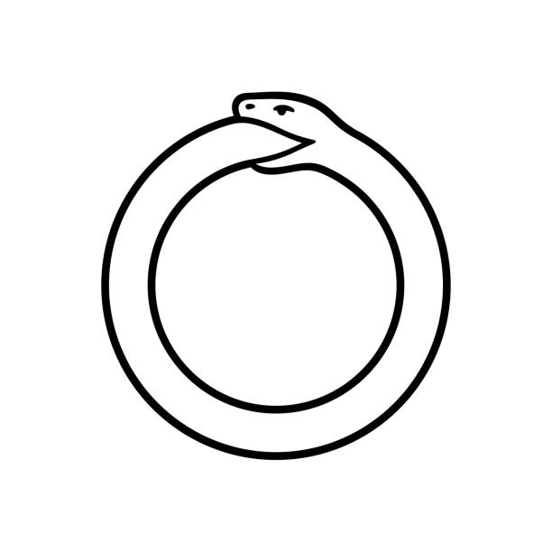
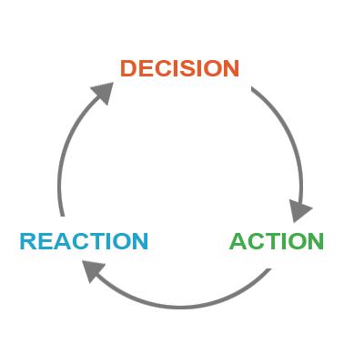

*If you want to learn any programming language you **MUST** type in the examples provided. Don't copy paste code. You **MUST** find more examples in the internet. The more you practice, the more you understand the concepts and learn faster.*

# Control Flow
Control flow is the logic that determines the order of execution of your code. 

It's similar to giving a person clear directions on how to get to their destination. From here walk straight to the junction, take a left turn and in about 200 meters you'll see a yellow building labelled `Control Flow`. You'll find soldiers on the entrance. Ask them the way forward.

## if else
Most things in life don't come freely. My take is that nothing is ever free, even gifts. Everything comes with a condition attached to it. 

- if you work hard at something, your odds of becoming successful at it increase. Else, your odds of failing at it increase.
- if you practice touch typing daily, you're more likely to learn it fast. Else, you're more likely to never learn touch typing.
- if you do an activity daily & consistently, it's more likely to become a habit to you. Else, it cannot become a habit.

`if else` statements work like the above examples:
```{r eval=FALSE}
if (condition) {
  consequence if condition is TRUE
}else {
  consequence if condition is FALSE
}
```

Say we have a variable `x` assigned the value of 2:
```{r}
x <- 2
```

We want to print "yes" if x is greater than 0 and "no" if x is less than 0. We'd do something like:
```{r eval=FALSE}
if (x > 0) {
  print("yes")
}else {
  print("no")
}
```

Which would result in:
```{r echo=FALSE}
if (x > 0) {
  print("yes")
}else {
  print("no")
}
```

That's because our condition (`x > 0`) evaluated to `TRUE`.

What if we change the "greater than" sign to "less than" sign?
```{r eval=FALSE}
if (x < 0) {
  print("yes")
}else {
  print("no")
}
```

The condition `x < 0` evaluates to `FALSE` and so the piece of code that is run is the one inside the `else` part and results in:
```{r echo=FALSE}
if (x < 0) {
  print("yes")
}else {
  print("no")
}
```

Something to keep in mind is that the condition should always evaluate to a logical (`TRUE` or `FALSE`) of length 1.

What happens if the condition is of length greater than 1?
```{r eval=FALSE}
x <- 1
y <- 0:3
condition <- x > y

if (condition) {
  print("Yeey!")
}else {
  print("Naay")
}
```

What if the condition is of length 0?
```{r eval=FALSE}
condition <- numeric(length = 0)

if (condition) {
  print("yes")
}else {
  print("no")
}
```

What is the value of x in:
```{r eval=FALSE}
x <- if ("a" < "b") {
  print("R says letter a is greater than letter b")
}else {
  print("When comparing letters, R sorts them alphabetically first. So a is less than b")
}
```

# Loops
<center>

</center>

A loop basically means going encircle, round and round. In programming, a loop has different stages:

- **Decision**:
To go or not to go into the loop is the question. A condition determines the decision made. If the condition evaluates to `TRUE`, then we go inside the loop. Else, the loop is terminated and we move on with other business.

- **Action**:
The condition evaluated to `TRUE` and we're in the loop. What is our purpose here? What is our work? Let's do it.


- **Reaction**:
Our work is done. Is there some extra work that might extend our stay in the loop city? Or do we go to the top of the loop and let `decision` stage "decide" whether we stay.

<center>

</center>

## while loops
The logic behind while loops is simple:

> while a given condition is `TRUE`, do this.

Say we assign 0 to `x`:
```{r}
x <- 0
```

Now we want to:

1. Print the value of `x`
2. Increment the value of `x` by 1

And our condition is: So long as the value of `x` is less than or equal to 5.

So our while statement in English would read:

> while x is less than or equal to 5, print x and increment it by 1

In R that would translate to:
```{r}
# initial value of x:
x <- 0

while (x <= 5) {
  # print value of x:
  print(x)
  
  # increment x by 1:
  x <- x + 1
}
```

## for loops
A for loop reads something like:

> for variable in this sequence, do this.

As in the previous example, say we want to print all values between 0 and 5 but this time using a for loop.

In English:

> for value in 0 to 5, print the value

In R:
```{r}
for (value in 0:5) {
  print(value)
}
```

Notice that unlike while loops, for loops don't need an initial value.

While loops are used when we aren't sure how long our sequence is. For loops are used when we know how long our sequence is. 

A while loop can do anything a for loop can do.

Exercise:

1. Print all letters in the alphabet using a for loop.
2. Print all even numbers between 1 and 100 using:
- a for loop
- a while loop

*Hint: Use if statements inside the loops*

# ifelse
`ifelse` is different from `if else` in R.

The reason I decided to bring it up after loops is because of a very important concept in R programming: vectorization.

Using **Vectorization** operations are applied to the whole vector instead of individual elements.

Let me illustrate what I mean.

Say we have a numeric vector x:
```{r}
x <- 1:5
```
And we want to increase every value of x by 1.

We can do that using a for loop:
```{r}
x <- 1:5

for (index in seq_along(x)) {
  x[index] <- x[index] + 1
  # Read that as:
  # Take x and subset the current index. Then add 1. Assign the result to 
  # x subset the current index.
}

print(x)
```
The for loop goes through every individual element of x, subsets the element and adds 1 to it. 

But R provides an easier and very fast way of performing that operation:
```{r}
x <- 1:5
x <- x + 1
print(x)
```
That is just a taste of what vectorization is. It's a powerful concept.

Back to `ifelse`. Say we have a vector y as follows:
```{r}
y <- 1:10
```
And we want to assign every value of y less than 5 the value 0. 

How would we achieve that?

Let's start with a for loop. In English:

> for value in y, if value is less than 5 change it to 0, else leave it as it is.

In R:
```{r}
y <- 1:10

for (index in seq_along(y)) {
  if (y[index] < 5) {
    y[index] <- 0
  }
}

print(y)
```

`ifelse` would also achieve that for us. But first, what is it's syntax?
```{r eval=FALSE}
ifelse (
  test, 
  return values for TRUE elements of test, 
  return values for FALSE elements of test
)
```

`ifelse` uses vectorization. To solve the previous example using `ifelse`:
```{r}
y <- 1:10

y <- ifelse(test = y < 5, yes = 0, no = y)

print(y)
```
But you can also achieve that using vectorization alone using logical subsetting of values.

Check this out:
```{r}
x <- 1:5
logical_values <- c(TRUE, FALSE, TRUE, FALSE, TRUE) 
x[logical_values]
```
What do you notice? R takes x then subsets its values which correspond to indices of `TRUE` values in logical_values.

And so:

```{r}
y <- 1:10

y < 5

```
That returns `TRUE` for the indices of y whose values are less than 5 and `FALSE` otherwise.

```{r}
y <- 1:10

y[y < 5]
```
That subsets those values of y less than 5.

```{r}
y <- 1:10

y[y < 5] <- 0

y
```
That assigns 0 to every value of y which is less than 0.

Exercise:

1. How would you return the real indices of those values of y less than 5 instead of returning logical values (`TRUE`s and `FALSE`s)?
2. How would you subset the last element of `y`, or just any vector?

# Functions

## What is a function?

## Why use functions?

## Examples of functions

## Function Arguments

## Function Body

## Function Environment

## Further Examples
